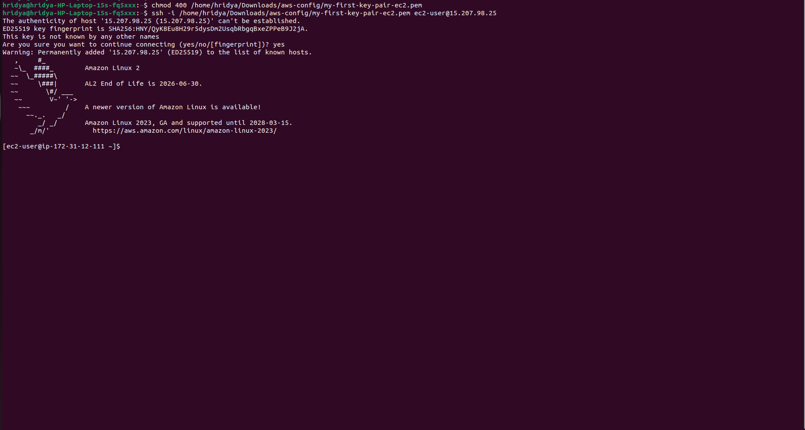

# tux-meets-cloud

This repo is a little snapshot of how I spent my day by learning with **AWS EC2**, **cloud storage**, and **Linux terminal commands** as part of my cloud computing journey.

## What I Did

- Launched an **Amazon EC2 instance** (Amazon Linux 2023)
- Connected securely using `ssh` and `.pem` key
- Explored the Linux terminal interface
- Mounted volumes and practiced volume management
- Understood the basics of cloud storage and terminal-based operations

## Why This Matters

> _"That black screen is where the real learning happens."_  
The terminal is not just a tool — it's where systems talk, problems get solved, and developers sharpen their focus. This session taught me more about:
- Patience
- Precision
- Real-world debugging
- The joy of solving small problems one step at a time

Then the cute little ASCII penguin showed up.
That’s Tux, the mascot of Linux. Basically, a tuxedo-wearing penguin saying:

"Welcome to the real world of computing."

## Screenshot

Here’s a glimpse of my experience connecting to an EC2 instance and seeing **Tux, the Linux Penguin**.

## Tech Stack

- Amazon EC2
- Linux Terminal (Amazon Linux 2023)
- SSH

## Tags

`#cloudcomputing` `#learnbydoing` `#linux` `#tux` `#ec2` `#aws`

